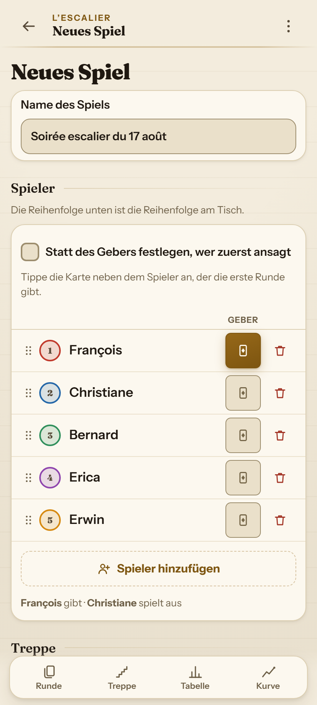
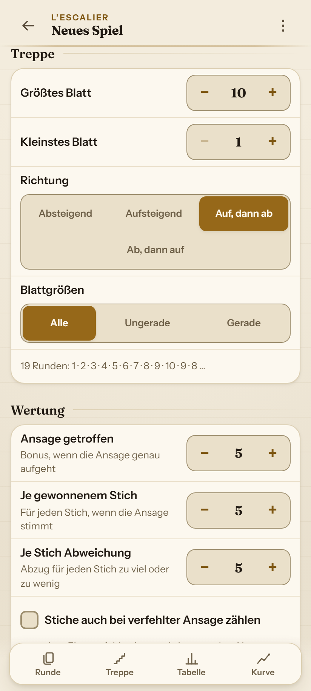
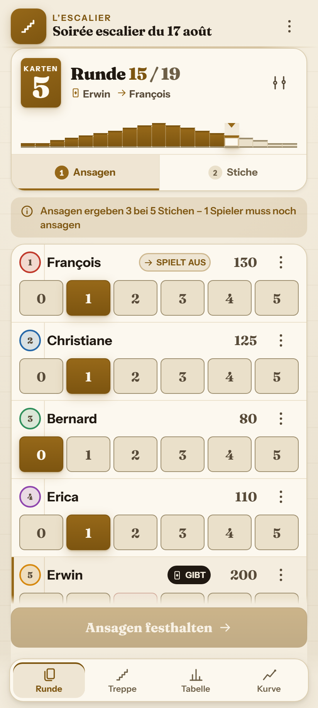
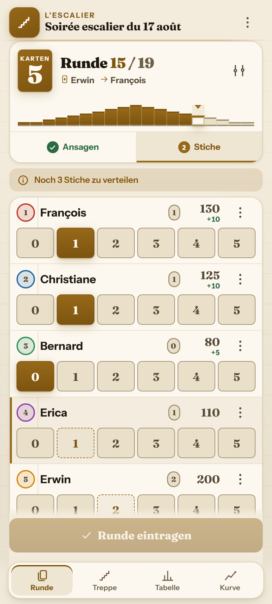
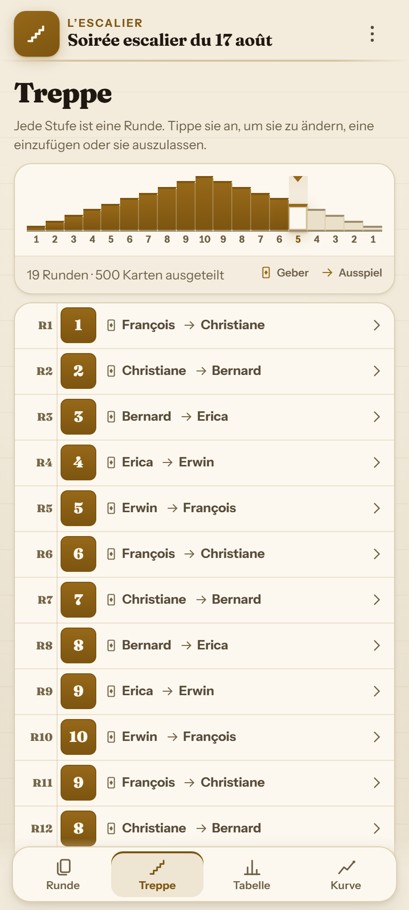
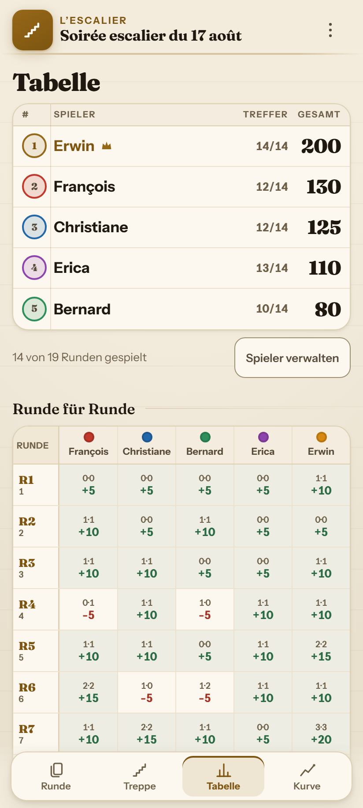
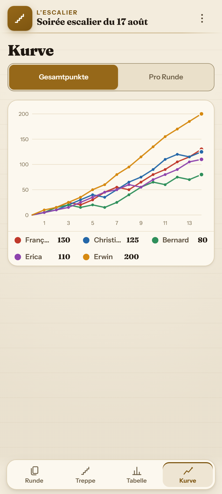
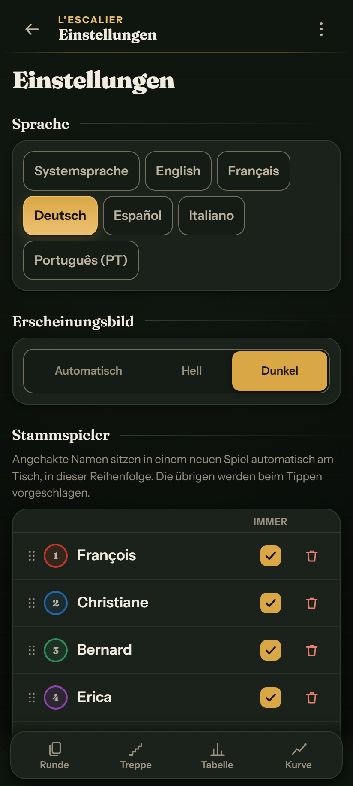

<div align="center">

# 🃏 L'Escalier

**Ein Offline-Punkteblock für Oh Hell (Stiche Raten / L'Escalier) und verwandte Kartenspiele**<br>
<sub>Wizard · Skull King · Rikiki · Nominate · Barbu · Tarneeb · Chorão</sub>

<br>

[](https://mayerwin.github.io/Escalier-Oh-Hell-Score-Keeper/)

<br>

[](#)
[](README.md)
[](README.fr.md)
[](README.es.md)
[](README.it.md)
[](README.pt.md)

<br>

[](https://github.com/mayerwin/Escalier-Oh-Hell-Score-Keeper/actions/workflows/ci.yml)
[](https://github.com/mayerwin/Escalier-Oh-Hell-Score-Keeper/actions/workflows/pages.yml)
[](LICENSE)


</div>

---

## 🎯 Warum L'Escalier?

Die meisten Punkte-Apps für Kartenspiele sind starr: eine feste Anzahl an Runden, eine unveränderliche Spielerliste und keine Möglichkeit, Korrekturen an vergangenen Runden vorzunehmen.

Am echten Spieltisch:
- 🚶 Jemand kommt später oder muss früher gehen.
- 🃏 Die Runde beschließt spontan eine Extra-Runde mit 1 Karte für maximale Spannung.
- ✏️ Vor drei Runden wurde ein Stich falsch eingetragen.
- 💡 Das Licht ist gedimmt, das Handy liegt in einer Hand, während schon ausgeteilt wird.

**L'Escalier wurde für den echten Spieltisch gebaut:**
- 📶 **100% Offline-fähig (PWA)**: Läuft ohne Internetverbindung, vollständig zwischengespeichert.
- 🔒 **Volle Privatsphäre**: Kein Server, kein Konto, keine Cookies, synchrone lokale Speicherung.
- 🔗 **Teilen ohne Server**: Das gesamte Spiel (Spieler, Treppe, alle Ansagen & Stiche) wird in einen kompakten URL-Link (~400 Zeichen) gepackt.

---

## 📸 Screenshots & Galerie

<div align="center">

| 1️⃣ Neues Spiel — Spieler | 2️⃣ Neues Spiel — Regeln |
|:---:|:---:|
|  |  |
| *Sitzordnung, Geber-Auswahl und Schnelleingabe.* | *Treppenmuster, Live-Vorschau und Punkte-Regler.* |

| 3️⃣ Ansage-Phase | 4️⃣ Stich-Phase |
|:---:|:---:|
|  |  |
| *Schnelleingabe, verbotene Ansage für den Geber durchgestrichen (🚫).* | *Live-Reststichzähler, automatische Punkte- und Differenzberechnung.* |

| 5️⃣ Treppen-Übersicht | 6️⃣ Rangliste & Tabelle |
|:---:|:---:|
|  |  |
| *Interaktive Treppe (1..10..1), Geber- und Ausspieler-Rotation.* | *Podest 🥇🥈🥉, Gesamtpunkte, Erfolgsquote und Rundengitter.* |

| 7️⃣ Punkteverlauf | 8️⃣ Dunkelmodus & Einstellungen |
|:---:|:---:|
|  |  |
| *Interaktive Verlaufskurven aller Spieler über alle Runden.* | *Filztisch-Dunkelmodus, 6 Sprachen, Stammspieler-Verwaltung.* |

</div>

---

## ✨ Hauptfunktionen

### 🪜 Jederzeit bearbeitbare Treppe
- ➕ Runden jederzeit an beliebiger Stelle einfügen oder löschen.
- 🔁 Handkartengröße anpassen oder Runden überspringen.
- 📐 Den unverspielten Rest der Treppe neu berechnen (aufsteigend, absteigend, Pyramide...).
- 🛡️ Gespielte Runden bleiben im Verlauf unverändert verankert.

### ⚖️ Zwei getrennte Phasen pro Runde
1. **Phase 1: Ansagen** — Jeder Spieler sagt der Reihe nach an (Ausspieler zuerst, Geber zuletzt).
2. **Phase 2: Erzielte Stiche** — Eingabe der tatsächlichen Stiche mit Restzähler, der exakt auf Null fallen muss.

### 🚫 Geber-Regel (« Screw the Dealer »)
- Die Summe der Ansagen darf nicht der Stichzahl entsprechen.
- Die verbotene Zahl wird **direkt auf dem Chip des Gebers durchgestrichen**.

---

## 🧮 Punkteberechnung

| Ergebnis | Formel | Beispiel (Bonus=5, Stich=5, Abzug=5) |
|:---|:---|:---|
| **Ansage getroffen** $(A = S)$ | $\text{Bonus} + (S \times \text{Punkte/Stich})$ | Ansage 2, Stiche 2 $\rightarrow 5 + (2 \times 5) = \mathbf{+15\text{ Pkt.}}$ |
| **Ansage verfehlt** $(A \neq S)$ | $- (\lvert A - S \rvert \times \text{Abzug})$ | Ansage 2, Stiche 0 $\rightarrow - (2 \times 5) = \mathbf{-10\text{ Pkt.}}$ |

---

## 🌐 Mehrsprachigkeit

Vollständig lokalisiert in **6 Sprachen** über die `Intl`-API:
[English](README.md) · [Français](README.fr.md) · [Deutsch](README.de.md) · [Español](README.es.md) · [Italiano](README.it.md) · [Português](README.pt.md).

---

## 🚀 Lokale Nutzung

Kein Build-Schritt erforderlich:

```sh
git clone https://github.com/mayerwin/Escalier-Oh-Hell-Score-Keeper.git
cd Escalier-Oh-Hell-Score-Keeper
npm run serve
```

---

## 📜 Lizenz

Veröffentlicht unter der [MIT-Lizenz](LICENSE). Erstellt von **Erwin Mayer** ([github.com/mayerwin](https://github.com/mayerwin)).
