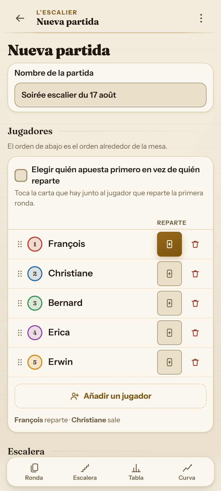
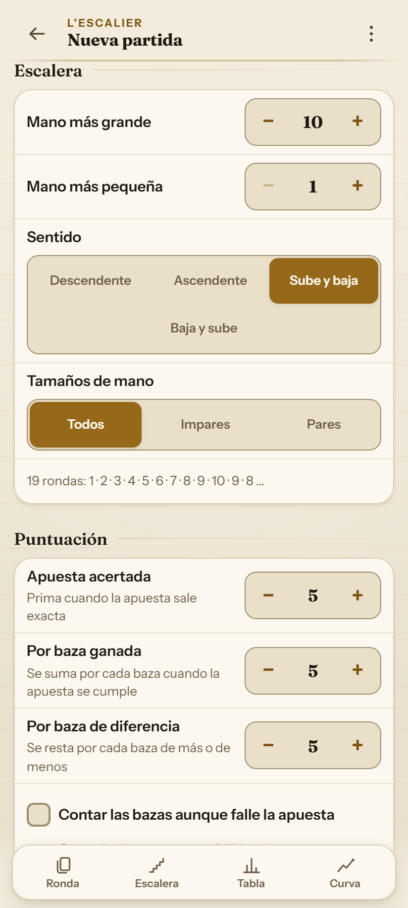
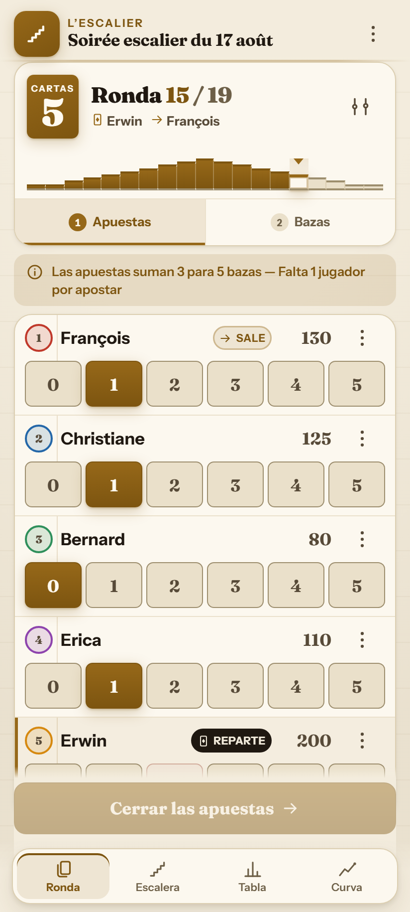
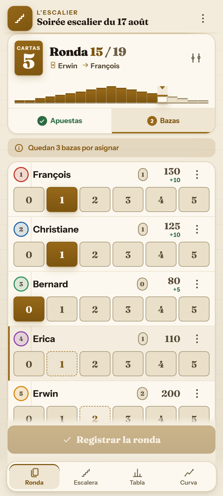
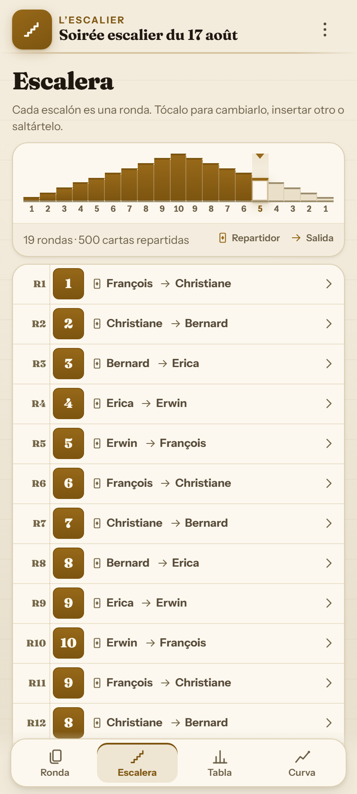
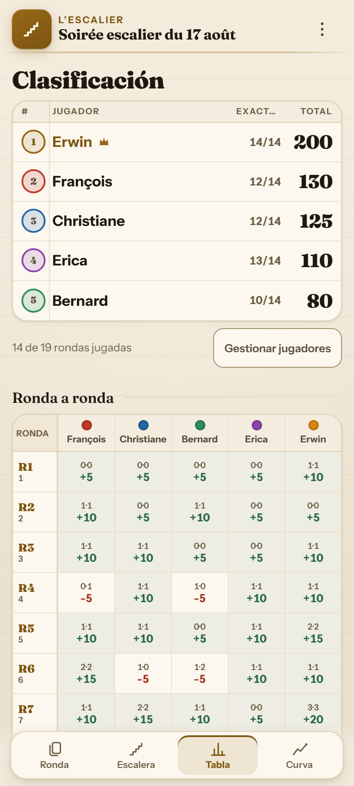
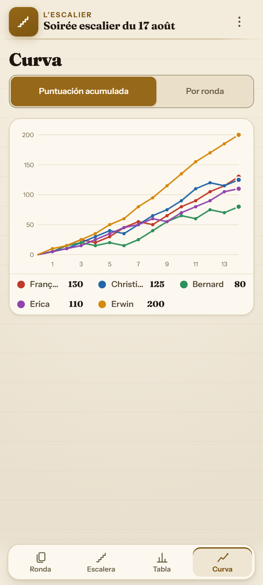
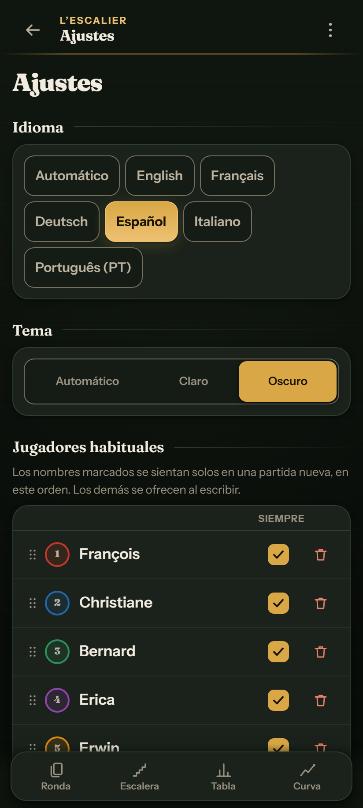

# 🃏 L'Escalier

**Anotador de puntos offline para Oh Hell (La Escalera / La Podrida) y sus variantes** 
Wizard · Skull King · Rikiki · Nominate · Stiche Raten · Barbu · Tarneeb · Chorão

 

 

 

---

## 🎯 ¿Por qué L'Escalier?

La mayoría de los anotadores asumen un juego estático. En una mesa real:
- 🚶 Alguien llega tarde o tiene que irse antes.
- 🃏 La mesa decide añadir una mano extra de 1 carta al final.
- ✏️ Se necesita corregir una baza registrada hace tres rondas.
- 💡 Poca luz, manejable con una sola mano.

**L'Escalier fue diseñado para la mesa real:**
- 📶 **100% Offline (PWA)**: Funciona sin internet.
- 🔒 **Privacidad Total**: Sin servidores, sin cuentas, sin cookies.
- 🔗 **Compartir sin Servidor**: Toda la partida cabe en un enlace compacto de URL (~400 caracteres).

---

## 📸 Capturas de Pantalla

| 1️⃣ Nueva Partida — Jugadores | 2️⃣ Nueva Partida — Escalera y Reglas |
|:---:|:---:|
|  |  |
| *Disposición de jugadores, selección de dador y añadir rápido.* | *Forma de escalera, vista previa y control de puntuación.* |

| 3️⃣ Fase de Apuestas | 4️⃣ Fase de Bazas |
|:---:|:---:|
|  |  |
| *Fichas rápidas, apuesta prohibida del dador tachada (🚫).* | *Contador de bazas restantes y cálculo inmediato de puntos.* |

| 5️⃣ Vista de Escalera | 6️⃣ Clasificación y Tabla |
|:---:|:---:|
|  |  |
| *Escalera interactiva (1..10..1) con rotación de mano y dador.* | *Podio 🥇🥈🥉, puntuaciones acumuladas y matriz de rondas.* |

| 7️⃣ Gráfico de Evolución | 8️⃣ Modo Oscuro y Ajustes |
|:---:|:---:|
|  |  |
| *Curvas de progreso de cada jugador en tiempo real.* | *Tema tapete verde oscuro, 6 idiomas y lista de jugadores habituales.* |

---

## 🧮 Cálculo de Puntuación

| Situación | Fórmula | Ejemplo (Bono=5, Baza=5, Penalización=5) |
|:---|:---|:---|
| **Apuesta cumplida** $(A = B)$ | $\text{Bono} + (B \times \text{Pts/Baza})$ | Apuesta 2, Bazas 2 $\rightarrow 5 + (2 \times 5) = \mathbf{+15\text{ pts}}$ |
| **Apuesta fallida** $(A \neq B)$ | $- (\lvert A - B \rvert \times \text{Penalización})$ | Apuesta 2, Bazas 0 $\rightarrow - (2 \times 5) = \mathbf{-10\text{ pts}}$ |

---

## 🌐 Documentación en otros idiomas

[English](README.md) · [Français](README.fr.md) · [Deutsch](README.de.md) · [Español](README.es.md) · [Italiano](README.it.md) · [Português](README.pt.md).

---

## 📜 Licencia

Publicado bajo la [Licencia MIT](LICENSE). Creado por **Erwin Mayer** ([github.com/mayerwin](https://github.com/mayerwin)).
