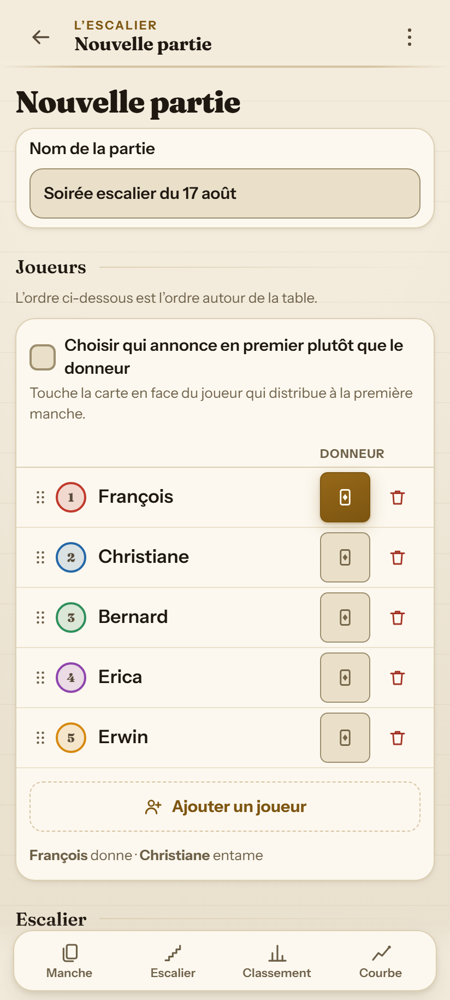
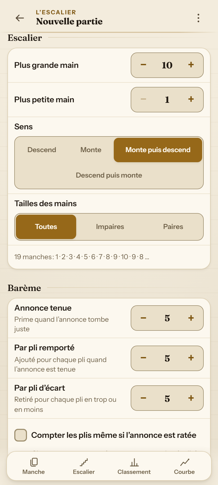
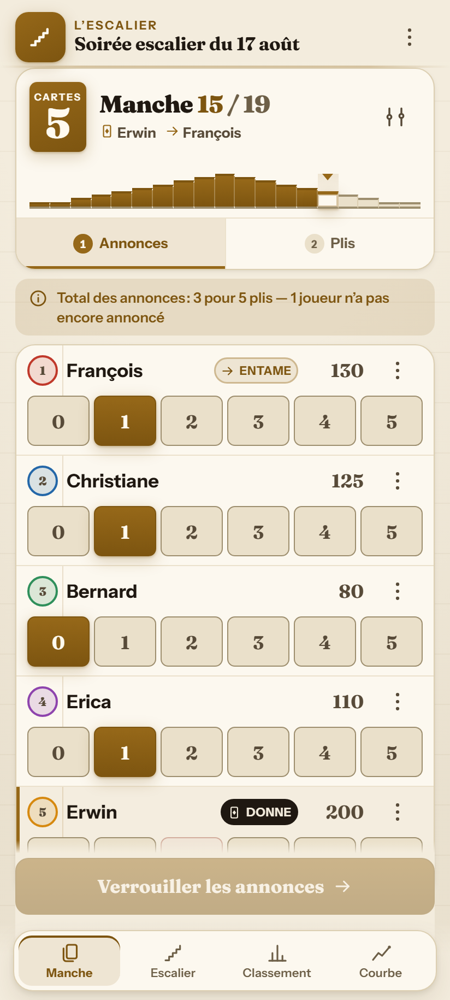
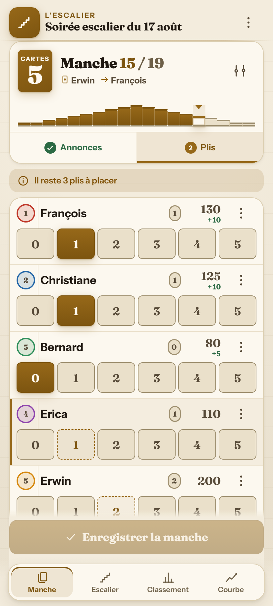
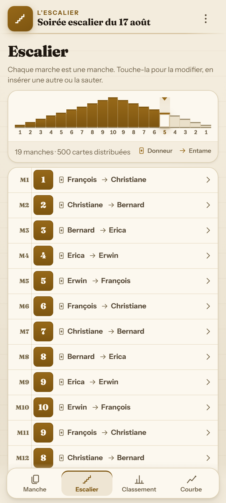
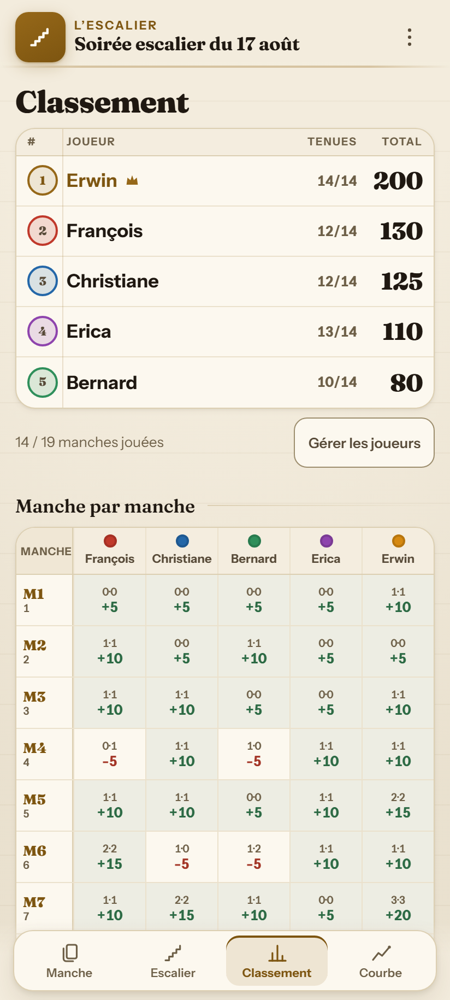
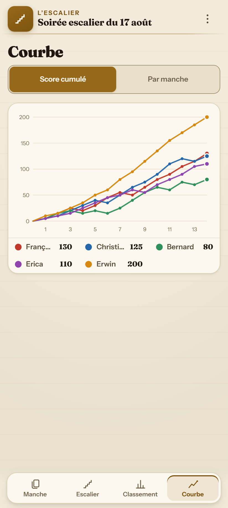
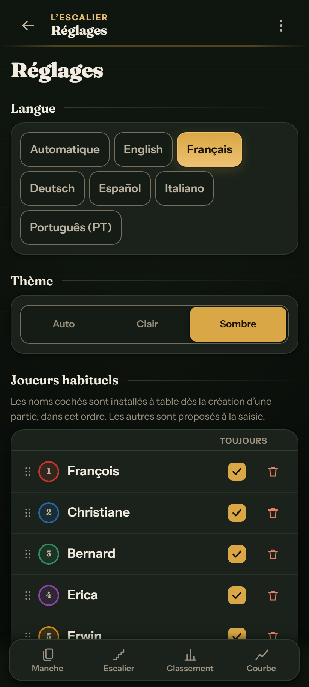

<div align="center">

# 🃏 L'Escalier

**Compteur de points hors-ligne pour le jeu de cartes l'Ascenseur / Escalier (*Oh Hell*) et toutes ses variantes**<br>
<sub>Wizard · Skull King · Rikiki · Casse-Tête · Stiche Raten · Barbu · Tarneeb · Chorão</sub>

<br>

[](https://mayerwin.github.io/Escalier-Oh-Hell-Score-Keeper/)

<br>

[](#)
[](README.md)
[](README.de.md)
[](README.es.md)
[](README.it.md)
[](README.pt.md)

<br>

[](https://github.com/mayerwin/Escalier-Oh-Hell-Score-Keeper/actions/workflows/ci.yml)
[](https://github.com/mayerwin/Escalier-Oh-Hell-Score-Keeper/actions/workflows/pages.yml)
[](LICENSE)


</div>

---

## 🎯 Pourquoi L'Escalier ?

La plupart des compteurs de score imposent un déroulement figé : une échelle de manches gravée dans le marbre, une liste de joueurs immuable et aucune possibilité de corriger une manche jouée trois tours plus tôt.

Dans la vraie vie autour d'une table de cartes :
- 🚶 Quelqu’un arrive en retard ou doit partir plus tôt.
- 🃏 La table décide d'ajouter une manche à 1 carte à la fin pour le suspense.
- ✏️ Une erreur de saisie est constatée après coup.
- 💡 La lumière est tamisée, on tient son téléphone d'une seule main pendant que le donneur distribue déjà.

**L'Escalier a été pensé pour la table réelle :**
- 📶 **100% hors-ligne (PWA)** : fonctionne sans réseau, préchargé dans le navigateur.
- 🔒 **Confidentialité totale** : zéro serveur, zéro compte, zéro cookie, stockage local instantané.
- 🔗 **Partage instantané** : toute la partie (joueurs, historique manche par manche, barème) est compressée dans un lien URL compact de ~400 caractères.

---

## 📸 Aperçu & Galerie d'écrans

<div align="center">

| 1️⃣ Configuration — Joueurs & Table | 2️⃣ Configuration — Volée & Barème |
|:---:|:---:|
|  |  |
| *Installation des joueurs, choix du premier donneur, ajout rapide.* | *Motif de volée personnalisable, aperçu en direct et curseurs de score.* |

| 3️⃣ Phase des Annonces | 4️⃣ Phase des Plis |
|:---:|:---:|
|  |  |
| *Puces rapides, contrat interdit du donneur barré (🚫), badge d'entame.* | *Décompte en direct des plis restants, calcul instantané des gains/pertes.* |

| 5️⃣ Volée de l'Escalier | 6️⃣ Tableau & Classement |
|:---:|:---:|
|  |  |
| *Visualisation globale des 19 marches (1..10..1), repère de manche active.* | *Podium 🥇🥈🥉, scores cumulés, taux de réussite et grille détaillée.* |

| 7️⃣ Graphique d'Évolution | 8️⃣ Mode Sombre & Réglages |
|:---:|:---:|
|  |  |
| *Courbes interactives des scores au fil des manches par joueur.* | *Thème tapis feutre sombre, 6 langues, carnet de joueurs habituels.* |

</div>

---

## ✨ Fonctionnalités clés

### 🪜 L'Escalier entièrement éditable à tout moment
Le plan des manches est une volée de marches interactive :
- ➕ Insérer une manche n'importe où.
- 🔁 Modifier le nombre de cartes d'une donne.
- ⏭️ Sauter une manche ou avancer le curseur de jeu.
- 📐 Recalculer le reste de l'escalier selon un nouveau motif (montant, descendant, pyramide, aller-retour...).
- 🛡️ Les manches déjà jouées restent scrupuleusement préservées et ancrées dans l'historique.

### ⚖️ Deux phases de jeu étanches
1. **Phase 1 : Les Annonces** — Chaque joueur annonce son contrat dans l'ordre de parole (l'ouvreur en premier, le donneur en dernier).
2. **Phase 2 : Les Plis réalisés** — Saisie des plis remportés avec un compteur dynamique de contrôle qui doit tomber exactement à zéro pour valider la manche.

### 🚫 Règle du Donneur (« Screw the Dealer »)
- La règle interdisant au donneur d'annoncer un nombre de plis faisant tomber le total pile sur le nombre de cartes de la manche est appliquée automatiquement.
- Le chiffre interdit est **barré directement sur la puce du donneur**, évitant tout calcul mental à la table.
- Règle paramétrable (active à partir de $N$ cartes ou désactivable).

### 👥 Gestion des aléas de la table
- **Arrivée tardive** : intégrez un nouveau joueur en cours de partie avec un score personnalisé.
- **Départ anticipé** : mettez un joueur en retrait sans casser la somme des plis des manches déjà archivées.
- **Pause d'une manche** : faites sauter un tour à un joueur momentanément absent.
- **Ajustement ponctuel** : appliquez un bonus ou malus personnalisé sur une manche.
- **Changement de place** : réorganisez l'ordre de la table par simple glisser-déposer.

### 📇 Mémoire des joueurs habituels (Roster)
- Enregistrez vos partenaires de jeu habituels dans les réglages.
- Les joueurs cochés sont automatiquement installés à table à chaque nouvelle partie.
- L'autocomplétion intelligente mémorise les prénoms au fil de vos parties.

### 🧮 Barème de score personnalisable
Ajustez les règles de points avec un aperçu dynamique en temps réel :
- **Prime de contrat exact** (ex. +5 pts).
- **Points par pli réussi** (ex. +5 pts / pli).
- **Pénalité par pli d'écart** (ex. -5 pts par pli de différence).
- **Mode strict** (accorde ou non les points de pli en cas de contrat manqué).

---

## 🧮 Calcul des Scores

Le calcul des points suit la formule standard de l'Escalier / Oh Hell :

| Situation | Formule de calcul | Exemple (Prime=5, Pli=5, Malus=5) |
|:---|:---|:---|
| **Contrat réussi** $(A = P)$ | $\text{Prime} + (P \times \text{Pts/Pli})$ | Annonce 2, Réalisé 2 $\rightarrow 5 + (2 \times 5) = \mathbf{+15\text{ pts}}$ |
| **Contrat manqué** $(A \neq P)$ | $- (\lvert A - P \rvert \times \text{Pénalité})$ | Annonce 2, Réalisé 0 $\rightarrow - (2 \times 5) = \mathbf{-10\text{ pts}}$ |
| **Contrat manqué (Mode Strict)** | $- (\lvert A - P \rvert \times \text{Pénalité}) + (P \times \text{Pts/Pli})$ | Annonce 2, Réalisé 1 $\rightarrow -5 + 5 = \mathbf{0\text{ pt}}$ |

---

## 🌐 Support Multilingue

L'application est intégralement traduite dans **6 langues** avec gestion native des pluriels et formats régionaux via l'API `Intl` :

| Langue | Code | Documentation | Sélecteur |
|:---|:---:|:---:|:---:|
| 🇫🇷 **Français** | `fr` | [README.fr.md](README.fr.md) | Intégré (Détection auto ou forçage) |
| 🇬🇧 **English** | `en` | [README.md](README.md) | Built-in (Auto-detect or override) |
| 🇩🇪 **Deutsch** | `de` | [README.de.md](README.de.md) | Integriert |
| 🇪🇸 **Español** | `es` | [README.es.md](README.es.md) | Integrado |
| 🇮🇹 **Italiano** | `it` | [README.it.md](README.it.md) | Integrato |
| 🇵🇹 **Português (PT)** | `pt` | [README.pt.md](README.pt.md) | Integrado |

---

## 🎨 Deux Thèmes Soignés

- 📜 **Papier Carnet (Clair)** : style registre quadrillé élégant pour jouer en pleine journée.
- 🌲 **Tapis de Table (Sombre)** : ambiance feutre vert profond et or vieilli, idéal pour les soirées tamisées et pour préserver la batterie.

---

## 🚀 Utilisation & Lancement Local

Aucune étape de compilation ni installation complexe n'est requise. L'application utilise des modules JavaScript ES natifs purs :

```sh
# 1. Cloner le dépôt
git clone https://github.com/mayerwin/Escalier-Oh-Hell-Score-Keeper.git
cd Escalier-Oh-Hell-Score-Keeper

# 2. Démarrer le serveur local
npm run serve
# ou directement avec Python :
# python -m http.server 8000
```

Ouvrez ensuite l'URL affichée (ex. `http://localhost:8000`) dans votre navigateur ou installez-la comme PWA sur votre smartphone.

---

## 🧪 Tests & Qualité

```sh
npm install            # Outils de dev uniquement (Playwright)
npm test               # Tests unitaires purs (Node test runner)
npm run test:e2e       # Tests E2E automatisés (Playwright)
npm run test:all       # Exécution de l'ensemble des tests
```

- **Tests unitaires** : moteur de calcul des scores, rotation du donneur, intégrité du cache offline du Service Worker, compression/décompression URL, export CSV.
- **Tests navigateurs** : cycle complet des manches, flux de saisie, verrouillage du contrat interdit, restauration hors-ligne.

---

## 🏗️ Structure du Code

```
Escalier-Oh-Hell-Score-Keeper/
├── assets/             # Polices locales (Fraunces, Instrument Sans) et icônes
├── docs/screenshots/   # Captures d'écran multilingues (en, fr, de, es, it, pt)
├── src/
│   ├── model.js        # Moteur logique pur (scores, rotations, validations)
│   ├── store.js        # Gestionnaire d'état réactif et actions
│   ├── i18n.js         # Moteur de traduction et pluriels Intl
│   ├── locales/        # Dictionnaires de traduction (fr, en, de, es, it, pt)
│   ├── share.js        # Compression URL (deflate-raw, base64url)
│   ├── export.js       # Formateurs d'export CSV et JSON
│   ├── dom.js          # Constructeur DOM sécurisé sans innerHTML
│   └── views/          # Vues modulaires (play, stairs, board, chart, setup...)
├── styles/app.css      # Feuille de style CSS moderne (variables, thèmes)
├── sw.js               # Service Worker PWA avec cache adressé par contenu
└── tools/              # Scripts de maintenance (serveur, build du SW, captures)
```

---

## 📜 Licence & Crédits

- **Code source** : sous licence [MIT](LICENSE).
- **Auteur** : **Erwin Mayer** ([github.com/mayerwin](https://github.com/mayerwin)).
- **Typographies** : [Fraunces](https://fonts.google.com/specimen/Fraunces) et [Instrument Sans](https://fonts.google.com/specimen/Instrument+Sans) sous licence SIL Open Font License.
- **Inspiration** : inspiré des règles traditionnelles de l'Escalier et d'[oh-hell-score](https://github.com/bdhoine/oh-hell-score).

<div align="center">
<sub>Fait avec passion pour les joueurs de cartes autour de la table. 🃏✨</sub>
</div>
