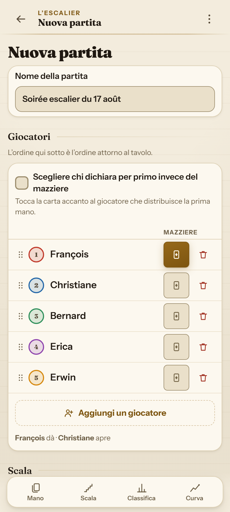
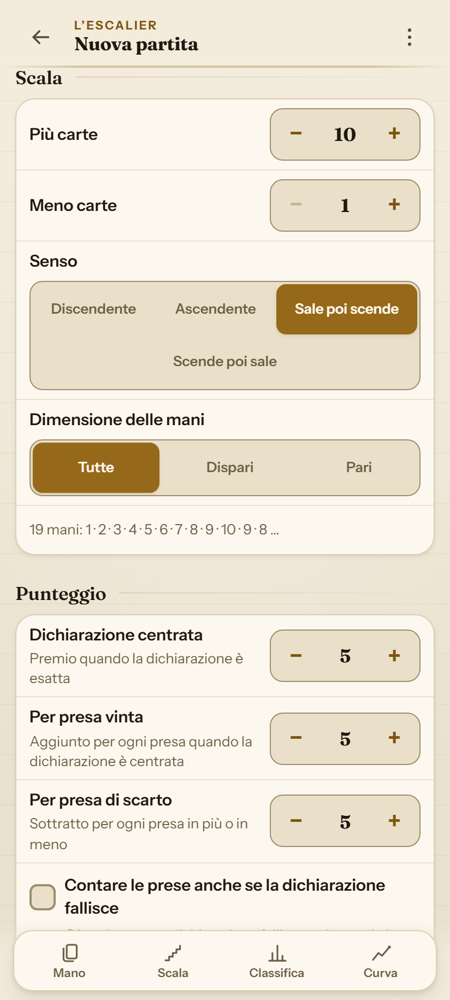
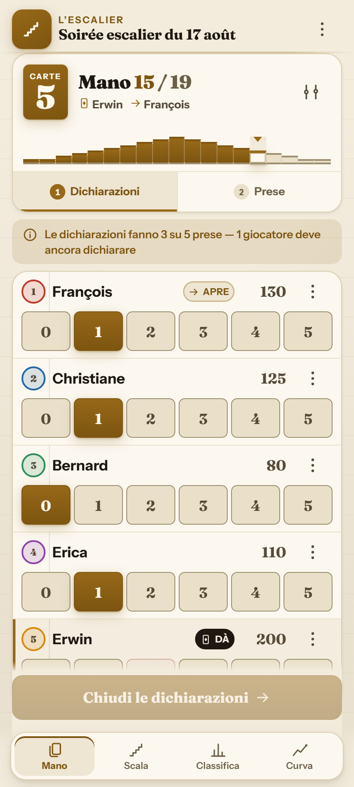
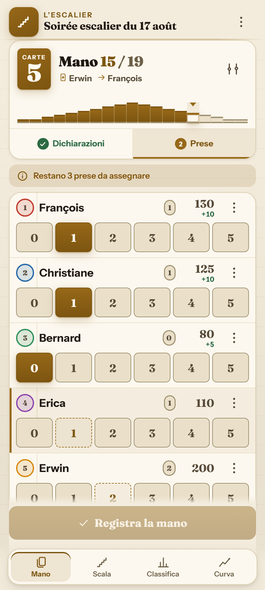
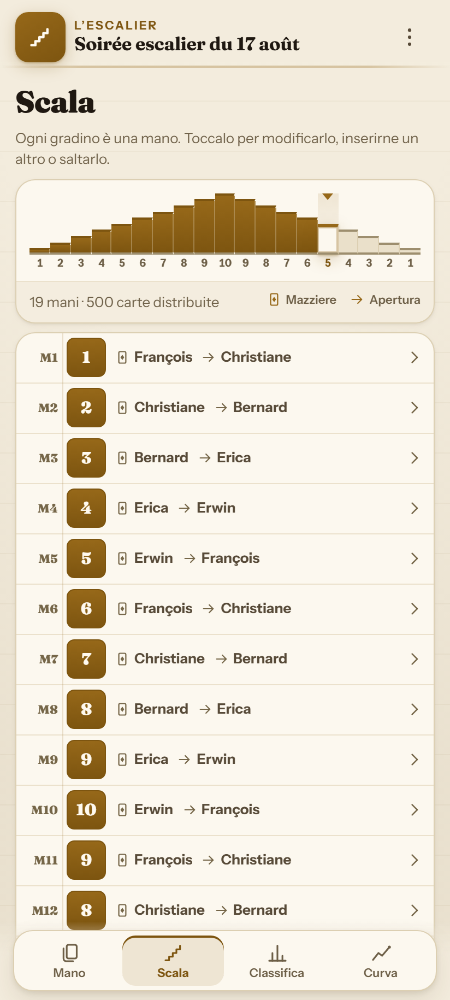
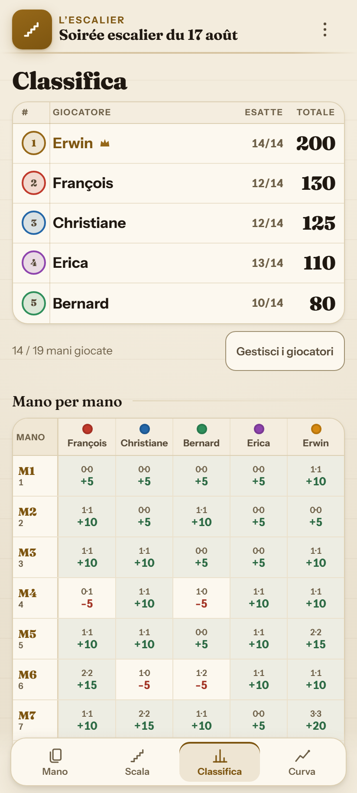
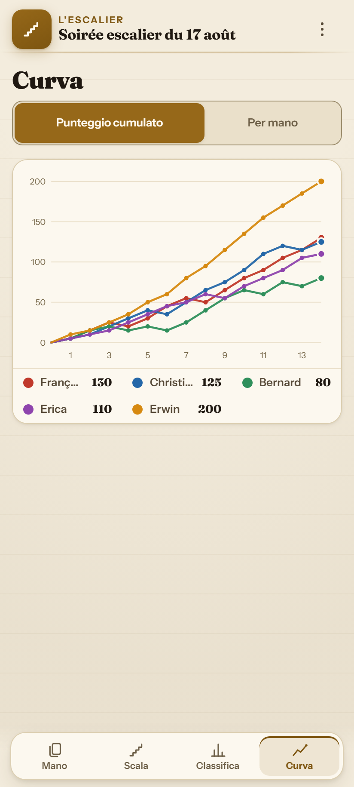
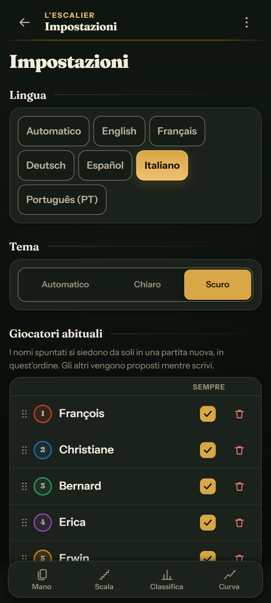

# 🃏 L'Escalier

**Segnapunti offline per Oh Hell (L'Ascensore / L'Escalier) e varianti** 
Wizard · Skull King · Rikiki · Nominate · Stiche Raten · Barbu · Tarneeb · Chorão

 

 

 

---

## 🎯 Perché L'Escalier?

Pensato appositamente per il tavolo di gioco reale:
- 📶 **100% Offline (PWA)**: Nessuna connessione necessaria.
- 🔒 **Privacy Totale**: Nessun server, nessun account, nessun cookie.
- 🔗 **Condivisione Istantanea**: Tutta la partita in un unico link URL (~400 caratteri).

---

## 📸 Galleria Screenshot

| 1️⃣ Nuova Partita — Giocatori | 2️⃣ Nuova Partita — Scala e Regole |
|:---:|:---:|
|  |  |
| *Configurazione giocatori, scelta del mazziere e aggiunta rapida.* | *Forma della scala, anteprima e regole punteggio.* |

| 3️⃣ Fase delle Previsioni | 4️⃣ Fase delle Prese |
|:---:|:---:|
|  |  |
| *Pulsanti rapidi, previsione vietata del mazziere barrata (🚫).* | *Conteggio prese rimanenti in tempo reale e calcolo punteggi.* |

| 5️⃣ Vista Scala | 6️⃣ Classifica e Tabella |
|:---:|:---:|
|  |  |
| *Scala interattiva (1..10..1) con rotazione mazziere/apertura.* | *Podio 🥇🥈🥉, punteggi totali e griglia dettagliata delle mani.* |

| 7️⃣ Grafico Andamento | 8️⃣ Tema Scuro e Impostazioni |
|:---:|:---:|
|  |  |
| *Curve interattive dell'evoluzione dei punti di ogni giocatore.* | *Tema panno verde scuro, 6 lingue e giocatori abituali.* |

---

## 🧮 Calcolo Punteggi

| Risultato | Formula | Esempio (Bonus=5, Presa=5, Penalità=5) |
|:---|:---|:---|
| **Previsione esatta** $(P = E)$ | $\text{Bonus} + (E \times \text{Pti/Presa})$ | Previsto 2, Fatto 2 $\rightarrow 5 + (2 \times 5) = \mathbf{+15\text{ pti}}$ |
| **Previsione errata** $(P \neq E)$ | $- (\lvert P - E \rvert \times \text{Penalità})$ | Previsto 2, Fatto 0 $\rightarrow - (2 \times 5) = \mathbf{-10\text{ pti}}$ |

---

## 🌐 Documentazione multilingue

[English](README.md) · [Français](README.fr.md) · [Deutsch](README.de.md) · [Español](README.es.md) · [Italiano](README.it.md) · [Português](README.pt.md).

---

## 📜 Licenza

Distribuito sotto [Licenza MIT](LICENSE). Creato da **Erwin Mayer** ([github.com/mayerwin](https://github.com/mayerwin)).
