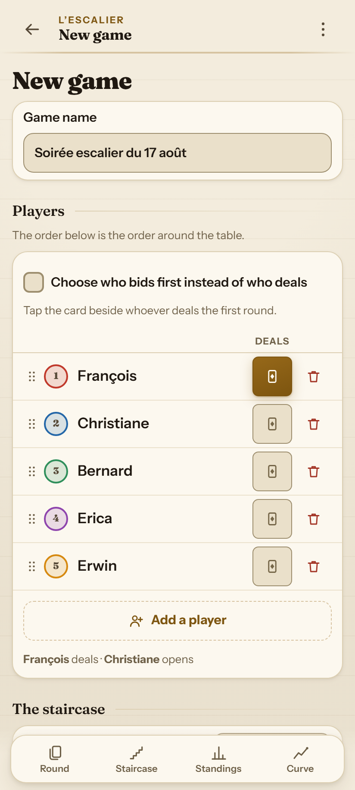
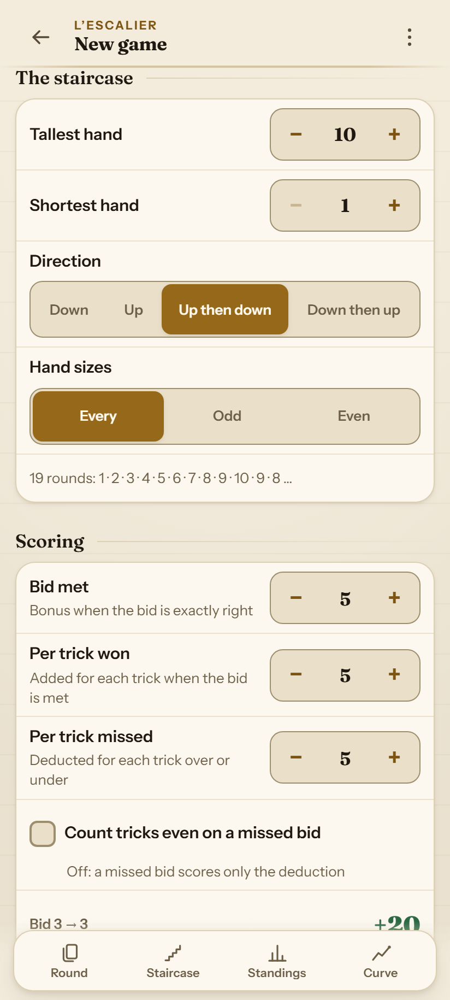
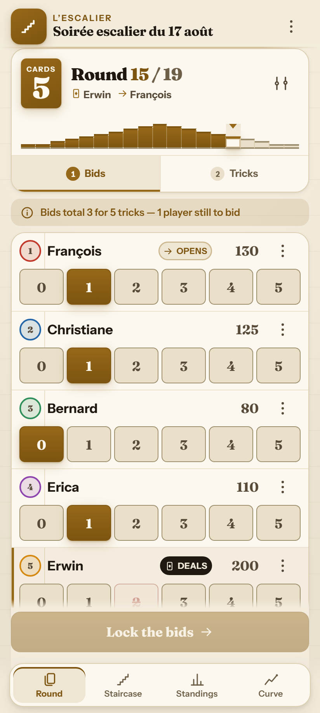
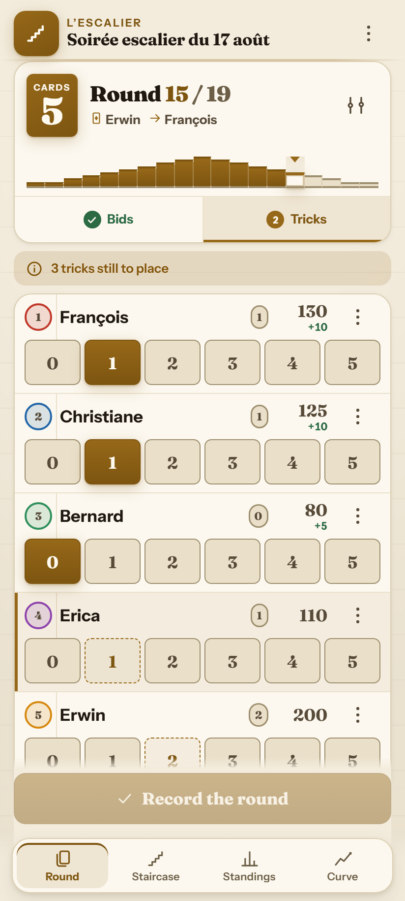
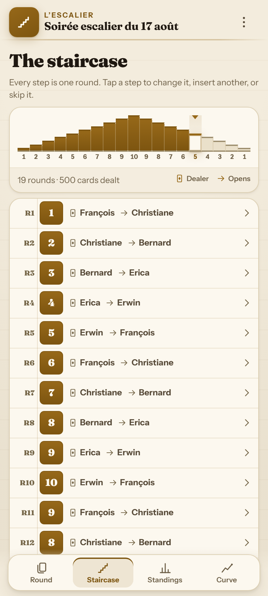
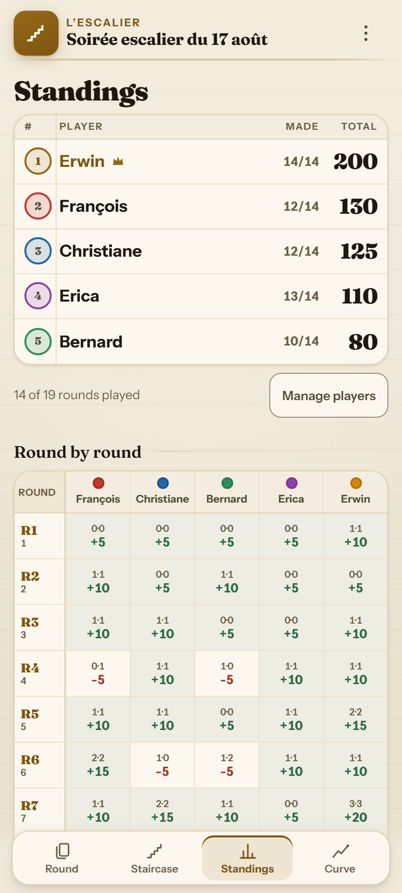
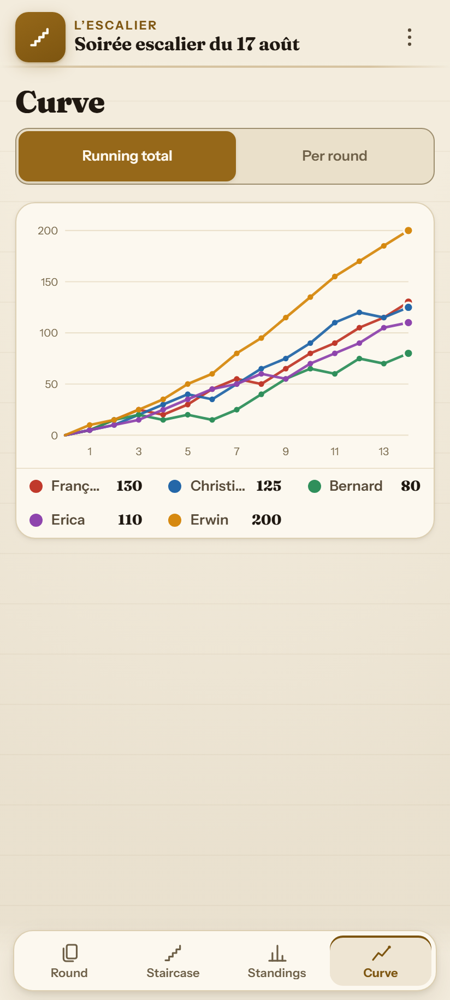
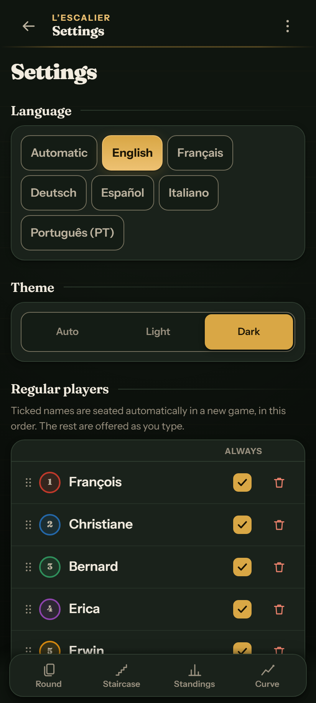

<div align="center">

# 🃏 L'Escalier

**An offline-first score keeper for Oh Hell (L'Escalier) and its many cousins**<br>
<sub>Wizard · Skull King · Rikiki · Nominate · Stiche Raten · Barbu · Tarneeb · Chorão</sub>

<br>

[](https://mayerwin.github.io/Escalier-Oh-Hell-Score-Keeper/)

<br>

[](#)
[](README.fr.md)
[](README.de.md)
[](README.es.md)
[](README.it.md)
[](README.pt.md)

<br>

[](https://github.com/mayerwin/Escalier-Oh-Hell-Score-Keeper/actions/workflows/ci.yml)
[](https://github.com/mayerwin/Escalier-Oh-Hell-Score-Keeper/actions/workflows/pages.yml)
[](LICENSE)


</div>

---

## 🎯 Why L'Escalier ?

Most score keepers assume a game is decided before it starts: a rigid ladder of rounds, a fixed list of players, and no way back once a round is recorded. Real games around a table are not like that.

In real life:
- 🚶 Somebody arrives late, or somebody has to leave early.
- 🃏 The table decides to add one more hand at 1 card at the end for suspense.
- ✏️ A score was entered wrong three rounds ago and needs fixing.
- 💡 The light is low, you hold the phone in one hand while someone is already dealing the next round.

**L'Escalier was built for the card table:**
- 📶 **100% Offline-First (PWA)**: Works completely without a network connection, fully precached.
- 🔒 **Complete Privacy**: Zero backend, zero accounts, zero cookies, instant synchronous local storage.
- 🔗 **Zero-Server Sharing**: An entire finished game (players, staircase, all bids & tricks, scoring rules) compresses into a single compact URL fragment (~400 characters).

---

## 📸 Interface Showcase

<div align="center">

| 1️⃣ Setup — Players & Seating | 2️⃣ Setup — Staircase & Rules |
|:---:|:---:|
|  |  |
| *Player seating, initial dealer selection, quick-add.* | *Custom staircase patterns, live preview and scoring sliders.* |

| 3️⃣ Bidding Phase | 4️⃣ Tricks Phase |
|:---:|:---:|
|  |  |
| *One-tap chips, dealer's forbidden bid struck out (🚫), opener badge.* | *Live remaining tricks countdown, instant score delta calculations.* |

| 5️⃣ Staircase Flight | 6️⃣ Standings & Scoreboard |
|:---:|:---:|
|  |  |
| *Interactive flight of stairs (1..10..1), active round marker, deal rotation.* | *Podium ranks 🥇🥈🥉, cumulative scores, hit rate, full round grid.* |

| 7️⃣ Evolution Chart | 8️⃣ Dark Mode & Settings |
|:---:|:---:|
|  |  |
| *Interactive curves showing each player's score progression over time.* | *Night-time card table baize theme, 6 languages, persistent player roster.* |

</div>

---

## ✨ Key Features

### 🪜 Fully Editable Staircase
The round plan is an interactive flight of stairs:
- ➕ Insert a round anywhere.
- 🔁 Resize a hand to any number of cards.
- ⏭️ Skip a round or jump the playhead forward.
- 📐 Rebuild the unplayed tail from a new shape (ascending, descending, pyramid, round-trip...).
- 🛡️ Played rounds are always strictly preserved in history.

### ⚖️ Two Explicit Phases Per Round
1. **Phase 1: Bids** — Every player calls their bid in order (opener first, dealer last).
2. **Phase 2: Tricks Won** — Record actual tricks won with a live countdown counter that must reach zero before completing the round.

### 🚫 "Screw the Dealer" Rule
- The classic rule forbidding the dealer from making total bids equal the trick count is enforced automatically.
- The forbidden number is **struck out on the dealer's own chips**, removing all mental arithmetic from the table.
- Configurable hand size threshold or can be turned off entirely.

### 👥 Real-World Table Dynamics
- **Late Arrivals**: Add a player mid-game with a custom starting score.
- **Early Departures**: Sit a player out without breaking trick totals of archived rounds.
- **Sit-out a Round**: Temporarily pause a player for one hand.
- **Adjustments**: Apply a custom one-off bonus or penalty.
- **Table Reorder**: Drag and reorder seating positions easily.

### 📇 Table Memory & Roster
- Save regular players in settings.
- Checked regulars are automatically seated when starting a new game.
- Smart autocomplete learns names as you play.

### 🧮 Configurable Scoring
Customize point formulas with a live worked example:
- **Bonus for made bid** (e.g. +5 pts).
- **Points per trick** (e.g. +5 pts / trick).
- **Penalty per trick of deviation** (e.g. -5 pts / trick diff).
- **Strict mode** (whether tricks still award points on a missed bid).

---

## 🧮 Scoring Calculation

| Outcome | Formula | Example (Bonus=5, Trick=5, Penalty=5) |
|:---|:---|:---|
| **Made Bid** $(B = T)$ | $\text{Bonus} + (T \times \text{Pts/Trick})$ | Bid 2, Won 2 $\rightarrow 5 + (2 \times 5) = \mathbf{+15\text{ pts}}$ |
| **Missed Bid** $(B \neq T)$ | $- (\lvert B - T \rvert \times \text{Penalty})$ | Bid 2, Won 0 $\rightarrow - (2 \times 5) = \mathbf{-10\text{ pts}}$ |
| **Missed Bid (Strict Mode)** | $- (\lvert B - T \rvert \times \text{Penalty}) + (T \times \text{Pts/Trick})$ | Bid 2, Won 1 $\rightarrow -5 + 5 = \mathbf{0\text{ pt}}$ |

---

## 🌐 Multilingual Support

Fully localized into **6 languages** with native plural and date formatting backed by the `Intl` API:

| Language | Code | Documentation | Selector in App |
|:---|:---:|:---:|:---:|
| 🇬🇧 **English** | `en` | [README.md](README.md) | Auto-detect or manual in Settings |
| 🇫🇷 **Français** | `fr` | [README.fr.md](README.fr.md) | Auto-detect or manual in Settings |
| 🇩🇪 **Deutsch** | `de` | [README.de.md](README.de.md) | Auto-detect or manual in Settings |
| 🇪🇸 **Español** | `es` | [README.es.md](README.es.md) | Auto-detect or manual in Settings |
| 🇮🇹 **Italiano** | `it` | [README.it.md](README.it.md) | Auto-detect or manual in Settings |
| 🇵🇹 **Português (PT)** | `pt` | [README.pt.md](README.pt.md) | Auto-detect or manual in Settings |

---

## 🎨 Dual Hand-Crafted Themes

- 📜 **Ledger Paper (Light)**: Elegant lined notebook styling for daytime play.
- 🌲 **Card-Table Baize (Dark)**: Deep green felt and vintage gold accents for night games and battery saving.

---

## 🚀 Running Locally

No build step or bundler needed. Pure vanilla ES modules:

```sh
# 1. Clone the repository
git clone https://github.com/mayerwin/Escalier-Oh-Hell-Score-Keeper.git
cd Escalier-Oh-Hell-Score-Keeper

# 2. Start the local server
npm run serve
# or with Python:
# python -m http.server 8000
```

Open the printed URL (e.g. `http://localhost:8000`) in your browser or install as a PWA on your smartphone.

---

## 🧪 Testing & Quality

```sh
npm install            # Dev tooling only (Playwright)
npm test               # Unit tests (Node test runner)
npm run test:e2e       # Automated browser tests (Playwright)
npm run test:all       # Run all tests
```

- **Unit tests**: Scoring logic, dealer rotation, Service Worker cache integrity, share URL codec, CSV export.
- **Browser tests**: End-to-end round flow, forbidden bids, mid-game staircase edits, offline reloading.

---

## 🏗️ Code Structure

```
Escalier-Oh-Hell-Score-Keeper/
├── assets/             # Bundled local fonts (Fraunces, Instrument Sans) and icons
├── docs/screenshots/   # Localized documentation screenshots (en, fr, de, es, it, pt)
├── src/
│   ├── model.js        # Pure game engine (scoring, rotation, validation)
│   ├── store.js        # Reactive state manager and actions
│   ├── i18n.js         # Translation engine & Intl plurals
│   ├── locales/        # Translation dictionaries (en, fr, de, es, it, pt)
│   ├── share.js        # URL compression (deflate-raw, base64url)
│   ├── export.js       # CSV and JSON exporters
│   ├── dom.js          # Safe DOM builder without innerHTML
│   └── views/          # Modular views (play, stairs, board, chart, setup...)
├── styles/app.css      # Modern CSS stylesheet (variables, themes)
├── sw.js               # Content-addressed offline PWA Service Worker
└── tools/              # Maintenance scripts (serve, build-sw, screenshot capture)
```

---

## 📜 License & Credits

- **Source Code**: Released under the [MIT License](LICENSE).
- **Author**: **Erwin Mayer** ([github.com/mayerwin](https://github.com/mayerwin)).
- **Typefaces**: [Fraunces](https://fonts.google.com/specimen/Fraunces) and [Instrument Sans](https://fonts.google.com/specimen/Instrument+Sans) under the SIL Open Font License.
- **Credits**: Inspired by traditional Oh Hell / L'Escalier card rules and [oh-hell-score](https://github.com/bdhoine/oh-hell-score).

<div align="center">
<sub>Made for a real card table. 🃏✨</sub>
</div>
