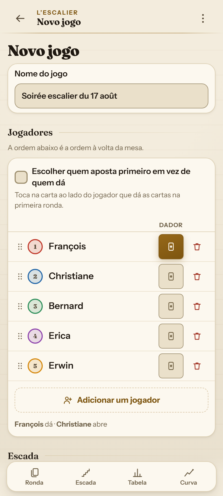
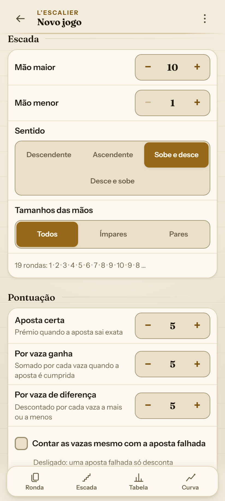
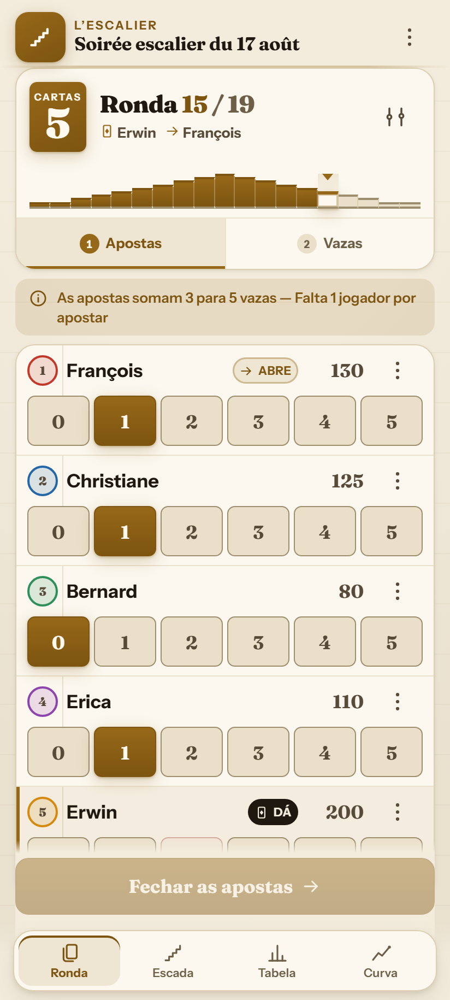
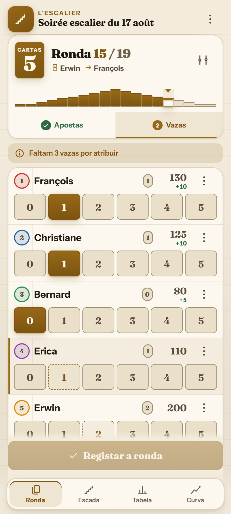
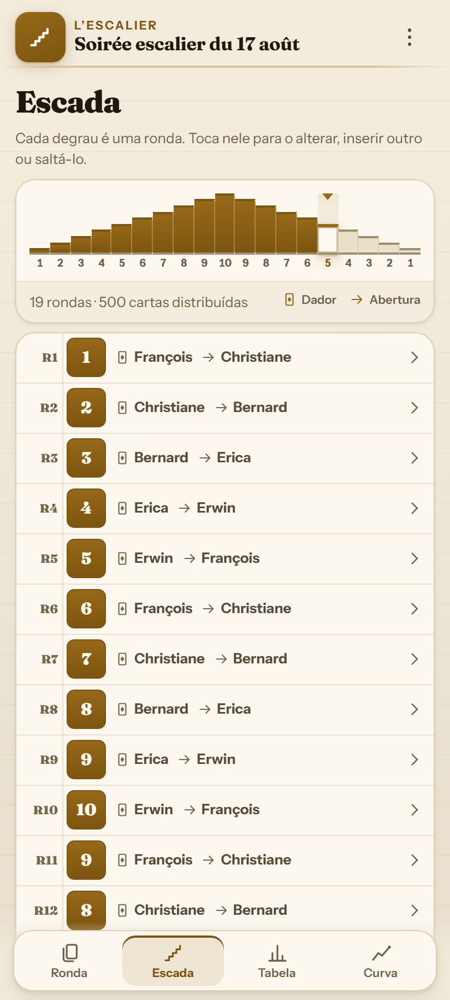
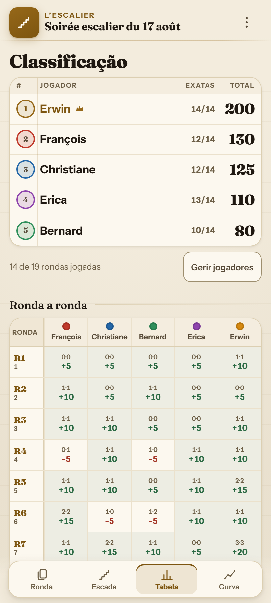
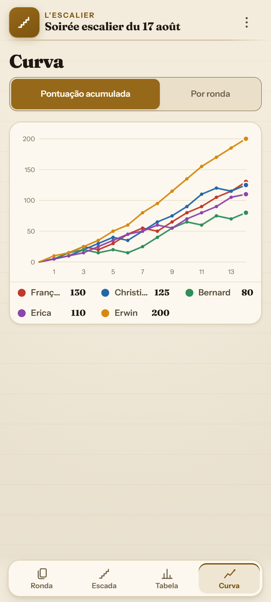
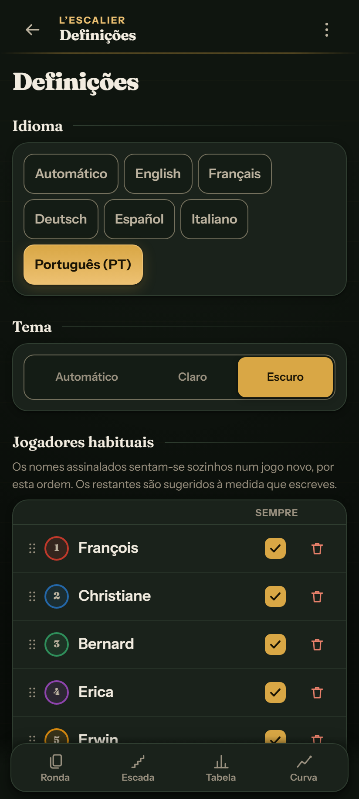

# 🃏 L'Escalier

**Marcador de pontos offline para Oh Hell (A Escada / Foda-se) e variantes** 
Wizard · Skull King · Rikiki · Nominate · Stiche Raten · Barbu · Tarneeb · Chorão

 

 

 

---

## 🎯 Porquê L'Escalier?

Feito especialmente para a mesa real de jogo:
- 📶 **100% Offline (PWA)**: Funciona sem ligação à rede.
- 🔒 **Privacidade Total**: Sem servidores, sem contas, sem cookies.
- 🔗 **Partilha Instantânea**: Todo o jogo num link de URL compacto (~400 caracteres).

---

## 📸 Capturas de Ecrã

| 1️⃣ Novo Jogo — Jogadores | 2️⃣ Novo Jogo — Escada e Regras |
|:---:|:---:|
|  |  |
| *Configuração dos jogadores, escolha do distribuidor e adicionar rápido.* | *Padrão da escada, pré-visualização e pontuação.* |

| 3️⃣ Fase de Apostas | 4️⃣ Fase de Vazas |
|:---:|:---:|
|  |  |
| *Fichas rápidas, aposta proibida do distribuidor riscada (🚫).* | *Contagem decrescente de vazas restantes e cálculo de pontuações.* |

| 5️⃣ Vista da Escada | 6️⃣ Classificação e Tabela |
|:---:|:---:|
|  |  |
| *Escada interativa (1..10..1) com rotação de distribuidor/abertura.* | *Pódio 🥇🥈🥉, pontuação acumulada e matriz detalhada de rondas.* |

| 7️⃣ Gráfico de Evolução | 8️⃣ Modo Escuro e Definições |
|:---:|:---:|
|  |  |
| *Curvas interativas de evolução das pontuações dos jogadores.* | *Tema tapete verde escuro, 6 idiomas e lista de jogadores habituais.* |

---

## 🧮 Cálculo de Pontuações

| Situação | Fórmula | Exemplo (Bónus=5, Vaza=5, Penalização=5) |
|:---|:---|:---|
| **Aposta cumprida** $(A = V)$ | $\text{Bónus} + (V \times \text{Pts/Vaza})$ | Aposta 2, Vazas 2 $\rightarrow 5 + (2 \times 5) = \mathbf{+15\text{ pts}}$ |
| **Aposta falhada** $(A \neq V)$ | $- (\lvert A - V \rvert \times \text{Penalização})$ | Aposta 2, Vazas 0 $\rightarrow - (2 \times 5) = \mathbf{-10\text{ pts}}$ |

---

## 🌐 Suporte Multilingue

Completamente traduzido em **6 idiomas** com formatação nativa de plurais e datas através da API `Intl`:

| Idioma | Código | Documentação | Seletor na Aplicação |
|:---|:---:|:---:|:---:|
| 🇵🇹 **Português (PT)** | `pt` | [README.pt.md](README.pt.md) | Deteção automática ou nas Definições |
| 🇬🇧 **English** | `en` | [README.md](README.md) | Deteção automática ou nas Definições |
| 🇫🇷 **Français** | `fr` | [README.fr.md](README.fr.md) | Deteção automática ou nas Definições |
| 🇩🇪 **Deutsch** | `de` | [README.de.md](README.de.md) | Deteção automática ou nas Definições |
| 🇪🇸 **Español** | `es` | [README.es.md](README.es.md) | Deteção automática ou nas Definições |
| 🇮🇹 **Italiano** | `it` | [README.it.md](README.it.md) | Deteção automática ou nas Definições |

---

## 📜 Licença

Distribuído sob [Licença MIT](LICENSE). Criado por **Erwin Mayer** ([github.com/mayerwin](https://github.com/mayerwin)).
